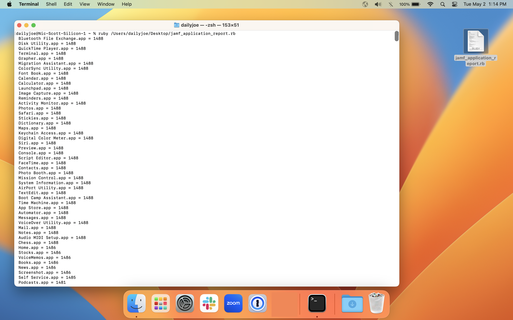

This is a script for hosted Jamf Pro that returns all the installed apps across your fleet and sorts them by most installed to least.  Update the variables `$jamfpro_url` and `$api_pw` in the script for your environment. It should return results up to 2000 computers. If you need more, you'll have to add pagination.

The basic concept is to call the `/api/v1/computers-inventory?section=APPLICATIONS` endpoint, loop through and add all apps and versions into a hash (dictionary) and then print and sort the results.

It takes your jamf username and password and converts it to a base64 string that you put in the `$api_pw` variable and then that generates a bearer token for the additional calls. The `invalidateToken` function at the very end, revokes the bearer token.

To get the base64 string you just put this into terminal and paste it into the `$api_pw`

```bash
printf "jamfUserName:JamfPassword" | iconv -t ISO-8859-1 | base64 -i -
```

> Note: Change out `jamfUserName` and `JamfPassword` with a user that has at least read only privileges in jamf. Make sure to keep the ":" inbetween the variables.

