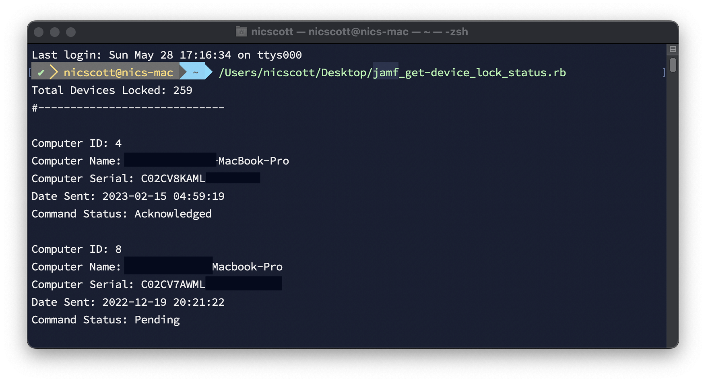

This is a script for hosted Jamf Pro that returns all computers that have been sent a remote lock command. It returns the computer ID, Computer Name, Serial, the date the command was sent, and the status of the command. Update the variables `$jamfpro_url` and `$api_pw` in the script for your environment. It should return results up to 2000 computers. If you need more, you'll have to add pagination.

To get the API token, it uses your  jamf username and password and converts it to a base64 string that you put in the `$api_pw` variable and then that generates a bearer token for the additional calls. The `invalidateToken` function at the very end, revokes the bearer token.

To get the API token, update the command below and paste it into terminal. Take the output and update the  `$api_pw` variable.

```bash
printf "jamfUserName:JamfPassword" | iconv -t ISO-8859-1 | base64 -i -
```

> Note: Change out `jamfUserName` and `JamfPassword` with a user that has at least read only privileges in jamf. Make sure to keep the ":" inbetween the variables.

